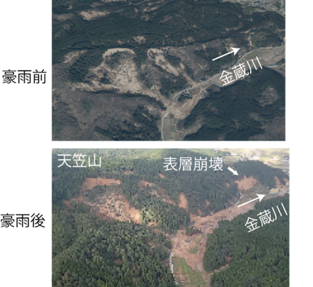

# NotoLocshare

Leaflet を使った地図表示の静的サイトです。複数の HTML ページで表示例や検証用ページを提供しています。

## 本プロジェクトの目的
能登半島では2024年1月の地震で各地で土砂災害が発生しました。さらに、同年9月の豪雨によっても多くの土砂災害が発生して、地域全体に甚大な被害を与えました。9月の土砂災害が1月の地震の影響を強く受けたことは、現地調査を通じてはっきりと感じることが出来ました。下の写真は9月豪雨前（2024年4月）と豪雨後（2024年10月）の町野町上田長地区の様子です。1月の地震によって左手の山で地すべり性崩壊が発生し土砂が流出していますが、豪雨後には山麓に堆積した崩壊土砂が流出して谷あいの平地に流出しています。また写真右側の山地では新たに崩壊が発生していますが、この斜面では、地震によって多くの亀裂が見られました。  
  
地震によって山地斜面の地盤が脆弱化して、地震後の豪雨時の土砂災害の増加につながることは知られており、関東大地震の丹沢山地などがとくに有名です（[井上, 2024](https://isabou.net/knowhow/colum-rekishi/colum93.asp)）。能登半島の山地斜面も2024年1月の地震によって脆弱化したり不安定土砂が堆積していると考えられます。斜面の脆弱化は、航空レーザー測量による地形データの解析によってもある程度把握することが出来ますが、現地調査で亀裂や斜面の変状を確認することが基本となります。このような危険な場所の情報の共有は、地震災害後の能登半島の地域防災を考える上で極めて大切になると思います。このプロジェクトは地域の住民の皆さんや自治体職員の皆さんが、災害に関する地理情報の共有を支援するツールを提供することを目的にしています。

## 構成

- ルート直下の HTML
  - `index.html` ほか各種サンプルページ
- `src/`
  - Leaflet 本体、プラグイン、CSS、画像、GeoJSON などのアセット

## 使い方

1. リポジトリを取得します。
2. ブラウザで `index.html` を開きます。

ローカルでファイルを開くだけで動作しますが、CORS の制限などで読み込みに失敗する場合は簡易サーバーで配信してください。

## 位置情報の共有機能

`noto2024.html` では、地図上の任意の地点を選んでURLリンクを生成し、メールやSNSで共有できます。
詳しい操作方法は [場所の共有方法（解説ページ）](help_locshare.html) を参照してください。

## 注意

- 地図タイルや外部 API の利用には各サービスの利用規約が適用されます。
- サンプルデータは検証目的のため、内容の正確性は保証しません。

## 関連データ 
- 本レポジトリでは、主として既往の公開データの参照を支援する技術を提供していますが、この他、[能登半島地震2024における地盤変動ベクトル推定 OpenCVテンプレートマッチングを用いた画像差分ベクトル解析](https://github.com/yokayoka/noto-landslide-opencv)では、OpenCVのテンプレートマッチング機能を利用した地すべりの変位推定プログラムと解析結果の例を公開しています。併進型地すべりの変位推定に関心のある方はこちらも、ご参照ください。 
## 変更履歴

### maff_elvchange3.html
- `maff_elvchange2.html` に `noto2024_v.html` の地図レイヤー群を統合したバージョン。
- Leaflet 1.7.1 + VectorGrid 1.3.0 を使用。
- 長いシェーダー・凡例データを `src/elvchange_shaders.js` に分離。
- ベースマップ: 地震前CS立体図 / 地震後CS立体図 / 5m色別（青→白→赤、デフォルト表示）
- オーバーレイ: 地理院地図 / 地震後写真 / 豪雨後写真東・西 / 地震崩壊地東部・西部（GeoJSON） / 旧地すべり地形 / 林野庁判読崩壊地・亀裂（PBFベクトルタイル） / 盛土
- 盛土レイヤー: `src/ffpri_json/fill.geojson` を `fetch` で非同期読み込み。能登半島における大規模盛土の分布を表示。
  - スタイル: オレンジ色（線・塗りつぶし）、塗りつぶし透過度 50%
  - 描画スクリプト: `src/draw_fill.js`
  - attribution: FFPRI & Bridge Project
- クリック時の標高値ポップアップ・凡例を保持。

### maff_elvchange2.html
- `maff_elvchange.html` の「5m色別」レイヤーのカラースキームを改善したバージョン。
- 変更点: value=0 付近でプラス側・マイナス側が同系色（緑）で識別しにくかった問題を解消。
  - 0 を白色に設定。
  - マイナス側（-70～0m）を青色→白色のグラデーションに変更。
  - プラス側（0～75m以上）を白色→赤色のグラデーションに変更。
  - classの区間は従来と同一。

## 謝辞
本技術の一部は、令和７年度石川県交付金「地すべりの発生プロセスの解明」の支援を受けて開発しました。ここに記して感謝いたします。
